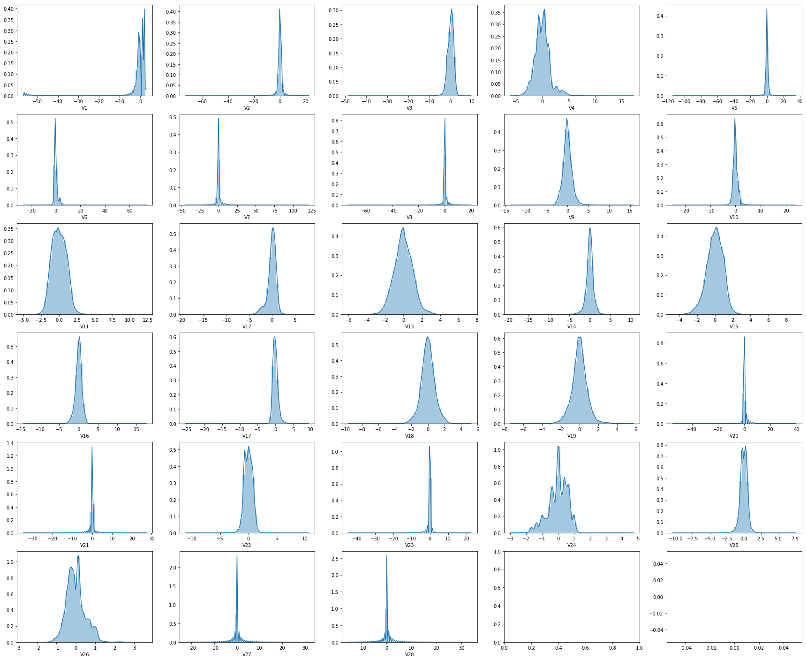
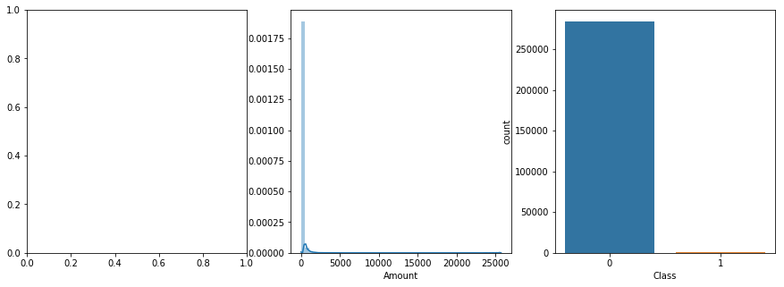
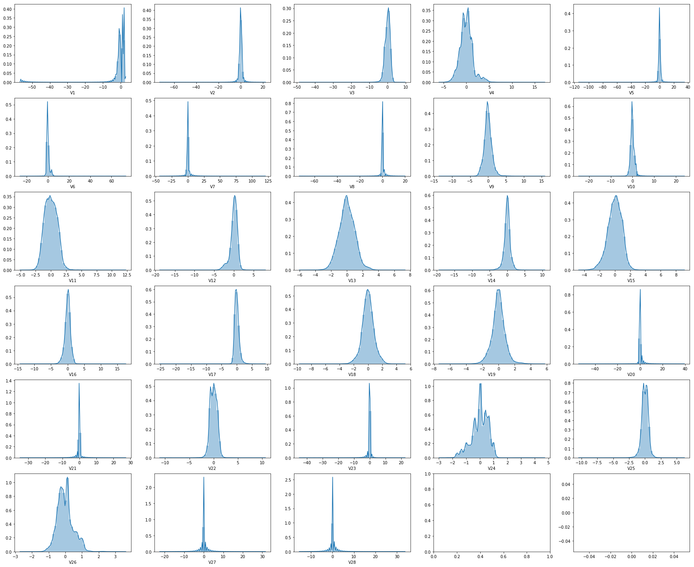
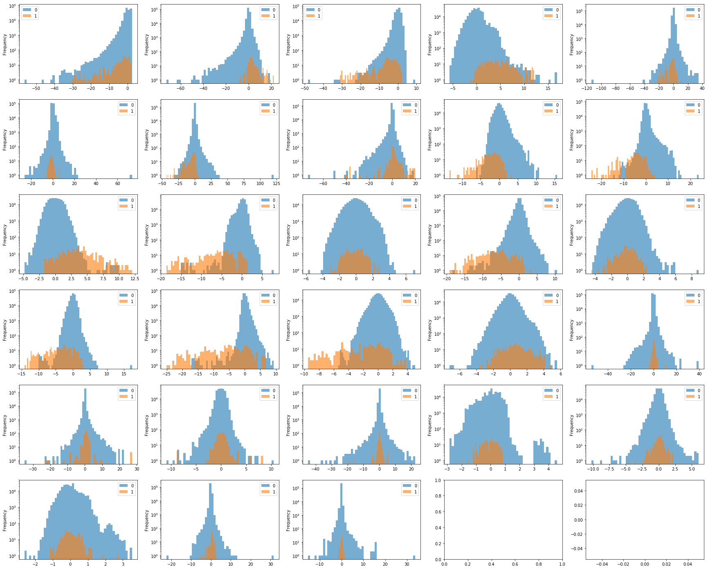
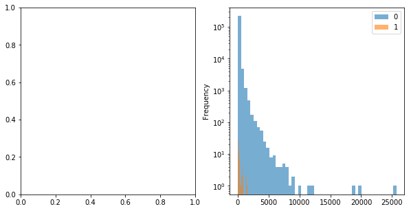
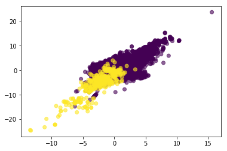
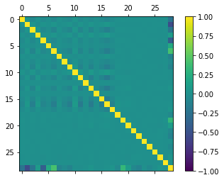
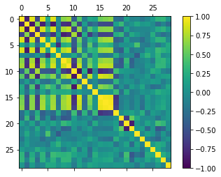
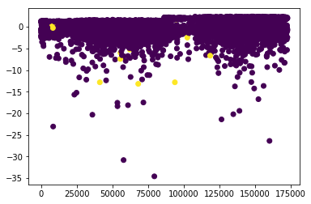
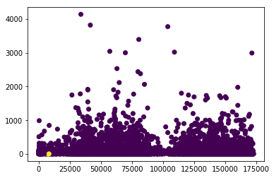

# Fraud Detection

## Data Loading and assessment


```python
import numpy as np
import pandas as pd
import matplotlib.pyplot as plt
import seaborn as sn
```


```python
data = pd.read_csv("creditcard.csv", dtype = {"Class" : "str"},  parse_dates=['Time'])
data.info()
```

    <class 'pandas.core.frame.DataFrame'>
    RangeIndex: 284807 entries, 0 to 284806
    Data columns (total 31 columns):
    Time      284807 non-null object
    V1        284807 non-null float64
    V2        284807 non-null float64
    V3        284807 non-null float64
    V4        284807 non-null float64
    V5        284807 non-null float64
    V6        284807 non-null float64
    V7        284807 non-null float64
    V8        284807 non-null float64
    V9        284807 non-null float64
    V10       284807 non-null float64
    V11       284807 non-null float64
    V12       284807 non-null float64
    V13       284807 non-null float64
    V14       284807 non-null float64
    V15       284807 non-null float64
    V16       284807 non-null float64
    V17       284807 non-null float64
    V18       284807 non-null float64
    V19       284807 non-null float64
    V20       284807 non-null float64
    V21       284807 non-null float64
    V22       284807 non-null float64
    V23       284807 non-null float64
    V24       284807 non-null float64
    V25       284807 non-null float64
    V26       284807 non-null float64
    V27       284807 non-null float64
    V28       284807 non-null float64
    Amount    284807 non-null float64
    Class     284807 non-null object
    dtypes: float64(29), object(2)
    memory usage: 67.4+ MB
    


```python
def plot_unnamed(df) :
    f , ((ax1, ax2, ax3, ax4, ax5),
         (ax6, ax7, ax8, ax9, ax10),
         (ax11 ,ax12, ax13, ax14, ax15), 
         (ax16, ax17, ax18, ax19, ax20),
         (ax21, ax22, ax23, ax24, ax25),
         (ax26, ax27, ax28, ax29, ax30)
        ) = plt.subplots(nrows = 6, ncols = 5, figsize = (30, 25) )

    axes = [ax1, ax2, ax3, ax4, ax5,
            ax6, ax7, ax8, ax9, ax10,
            ax11 ,ax12, ax13, ax14, ax15, 
            ax16, ax17, ax18, ax19, ax20,
            ax21, ax22, ax23, ax24, ax25,
            ax26, ax27, ax28, ax29, ax30]

    for variable in range(1, 29) :
      sn.distplot(df[ "V" + str(variable)], ax = axes[variable - 1])

    plt.plot()
    f.savefig("variable_distributions")
    
plot_unnamed(data)    
```

    C:\Users\NOTEBOOK\Miniconda3\lib\site-packages\scipy\stats\stats.py:1713: FutureWarning: Using a non-tuple sequence for multidimensional indexing is deprecated; use `arr[tuple(seq)]` instead of `arr[seq]`. In the future this will be interpreted as an array index, `arr[np.array(seq)]`, which will result either in an error or a different result.
      return np.add.reduce(sorted[indexer] * weights, axis=axis) / sumval
    





```python
def plot_named(df) :

    f , ((ax1, ax2, ax3)) = plt.subplots(nrows = 1, ncols = 3, figsize = (15, 5) )

    #sn.countplot(df["Time"].astype("str"), ax = ax1)
    sn.distplot(df["Amount"], ax = ax2)
    sn.countplot(df["Class"], ax = ax3)

    plt.plot()
    f.savefig("named_distributions.png")

plot_named(data)
```

    C:\Users\NOTEBOOK\Miniconda3\lib\site-packages\scipy\stats\stats.py:1713: FutureWarning: Using a non-tuple sequence for multidimensional indexing is deprecated; use `arr[tuple(seq)]` instead of `arr[seq]`. In the future this will be interpreted as an array index, `arr[np.array(seq)]`, which will result either in an error or a different result.
      return np.add.reduce(sorted[indexer] * weights, axis=axis) / sumval
    





## Building data sets


```python
from sklearn.model_selection import train_test_split

training_set, test_set = train_test_split(data, stratify = data["Class"], test_size =  0.2, random_state = 42)
```


```python
from os import mkdir, chdir
from os.path import exists
from scipy.stats import pearsonr

if not exists("TrainingData") :
    mkdir("TrainingData")    
chdir("TrainingData") 

plot_unnamed(training_set)
plot_named(training_set)
```

    C:\Users\NOTEBOOK\Miniconda3\lib\site-packages\scipy\stats\stats.py:1713: FutureWarning: Using a non-tuple sequence for multidimensional indexing is deprecated; use `arr[tuple(seq)]` instead of `arr[seq]`. In the future this will be interpreted as an array index, `arr[np.array(seq)]`, which will result either in an error or a different result.
      return np.add.reduce(sorted[indexer] * weights, axis=axis) / sumval
    





```python
def plot_correlation(data) :
    fig = plt.figure()
    ax = fig.add_subplot(111)
    matrix = ax.matshow(data.corr(), vmin=-1, vmax=1)
    fig.colorbar(matrix)

plot_correlation(training_set)
plt.savefig("correlations.png")
```


As variables come from PCA they are uncorrelated.

### Conditionnal characteristics


```python
def hist(df, variable, group_by, bins=50, ax = None) :
    V = df[variable]
    V.plot(kind='hist', bins = 50, alpha=.6, legend=True, logy = True, ax = ax)

def cond_dist_unnamed(df, group_by) :
    
    f , ((ax1, ax2, ax3, ax4, ax5),
         (ax6, ax7, ax8, ax9, ax10),
         (ax11 ,ax12, ax13, ax14, ax15), 
         (ax16, ax17, ax18, ax19, ax20),
         (ax21, ax22, ax23, ax24, ax25),
         (ax26, ax27, ax28, ax29, ax30)
        ) = plt.subplots(nrows = 6, ncols = 5, figsize = (30, 25))

    axes = [ax1, ax2, ax3, ax4, ax5,
            ax6, ax7, ax8, ax9, ax10,
            ax11 ,ax12, ax13, ax14, ax15, 
            ax16, ax17, ax18, ax19, ax20,
            ax21, ax22, ax23, ax24, ax25,
            ax26, ax27, ax28, ax29, ax30]

    df = df.groupby(group_by)
    for variable in range(1, 29) :
        hist(df,  "V" + str(variable), group_by, ax  = axes[variable - 1])
    plt.plot()
    f.savefig("variable_conditionnal_distributions.png")

def cond_dist_named(df, group_by) :
    
    f , ((ax1, ax2)) = plt.subplots(nrows = 1, ncols = 2, figsize = (10, 5))
    df = df.groupby(group_by)
    #hist(df,  "Time", group_by, ax  = ax1)
    hist(df,  "Amount", group_by, ax  = ax2)
    plt.plot()
    f.savefig("named_conditionnal_distributions.png")

cond_dist_unnamed(training_set, group_by = "Class")
cond_dist_named(training_set, group_by = "Class")
```








```python
data = training_set.sort_values("Class") 

plt.scatter(x = data["V9"], y= data["V10"], c = data["Class"], alpha  = 0.6)
```


    <matplotlib.collections.PathCollection at 0x28df2249b00>





```python
gr = training_set.groupby('Class')
gr0 = gr.get_group("0")

plot_correlation(gr0)
plt.savefig("gr0_correlations.png")
```





```python
gr1 = gr.get_group("1")

plot_correlation(gr1)
plt.savefig("gr1_correlations.png")
```





```python
plt.scatter(training_set["Time"][0:10000].astype("int"), training_set["V1"][0:10000],
            c = training_set["Class"][0:10000])
```


    <matplotlib.collections.PathCollection at 0x28d857d9940>





```python
plt.scatter(training_set["Time"][0:10000].astype("int"), training_set["Amount"][0:10000],
            c = training_set["Class"][0:10000])
```


    <matplotlib.collections.PathCollection at 0x28d857d9dd8>





Conditional exploration revealed interesting pattern of data, mostly correlated variables in the fraud category. Such patterns is seen from V1 to V22. However I will keep all components for spreading of data is also variable between the two groups. Amount of transaction will be kept for the same reason. However time doesn't seems to add relevant information to the data, so it will be excluded.


## Prepare data 


```python
from numpy.random import seed
from tensorflow import set_random_seed
import tensorflow as tf

from keras.layers.core import Dense
from keras.layers import Conv1D, Input, Add, Concatenate, Flatten, Reshape
from keras.models import Model, Sequential, load_model
import keras.backend as K

set_random_seed(42)
seed(42)
```

    Using TensorFlow backend.
    


```python
def filter_data(data) :
   return data.drop("Time", axis = 1)

training_set = filter_data(training_set)

def split_set(data, labels_col = "Class") :
    labels = data[labels_col]
    return {"labels" : labels,
           "data" : data.drop(labels_col, axis = 1)}
          
training_set = split_set(training_set)

print(training_set["data"].shape)
```

    (227845, 29)
    


```python
training_set["labels"].unique()
```


    array(['0', '1'], dtype=object)


## Build Model

In order to take advantage of correlation pattern, I will use a convolutional neural network.

### Simple Feed Forward


```python
input_ff_1 = Input(shape = (29,))
dense_layer_ff_1 = Dense(10, activation = "selu", 
                         kernel_initializer = "he_normal")(input_ff_1)
dense_layer_ff_2 = Dense(5, activation = "selu",
                        kernel_initializer = "he_normal")(dense_layer_ff_1)
output_layer_ff = Dense(1, activation = "tanh",
                    kernel_initializer = "glorot_uniform")(dense_layer_ff_2)

model_ff = Model(input_ff_1, output_layer_ff)
```


```python
model_ff.summary()
```

    _________________________________________________________________
    Layer (type)                 Output Shape              Param #   
    =================================================================
    input_1 (InputLayer)         (None, 29)                0         
    _________________________________________________________________
    dense_1 (Dense)              (None, 10)                300       
    _________________________________________________________________
    dense_2 (Dense)              (None, 5)                 55        
    _________________________________________________________________
    dense_3 (Dense)              (None, 1)                 6         
    =================================================================
    Total params: 361
    Trainable params: 361
    Non-trainable params: 0
    _________________________________________________________________
    


```python
def compute_weights(labels) :
    levels = set(labels)
    length = len(labels)
    weights = {}
    for level in levels :
        weights[level] = 1 - labels.count(level) / length
    return weights

class_weights = compute_weights(training_set["labels"].tolist())
```


```python
model_ff.compile(optimizer = 'adam', 
              loss = 'binary_crossentropy', 
              weighted_metrics= ['accuracy'])
```


```python
model_ff.fit(np.asarray(training_set["data"]).reshape(227845, 29), 
          np.asarray(training_set["labels"]).reshape(227845, 1), 
             batch_size = 5000, epochs = 20, class_weight = class_weights,
            validation_split=0.05)
```

    Train on 216452 samples, validate on 11393 samples
    Epoch 1/20
    216452/216452 [==============================] - 1s 4us/step - loss: 0.0076 - weighted_acc: 0.0017 - val_loss: 0.0079 - val_weighted_acc: 0.0019
    Epoch 2/20
    216452/216452 [==============================] - 1s 3us/step - loss: 0.0075 - weighted_acc: 0.0015 - val_loss: 0.0140 - val_weighted_acc: 0.0014
    Epoch 3/20
    216452/216452 [==============================] - 1s 3us/step - loss: 0.0075 - weighted_acc: 0.0014 - val_loss: 0.0114 - val_weighted_acc: 0.0015
    Epoch 4/20
    216452/216452 [==============================] - 1s 2us/step - loss: 0.0061 - weighted_acc: 0.0016 - val_loss: 0.0069 - val_weighted_acc: 0.0021
    Epoch 5/20
    216452/216452 [==============================] - 1s 2us/step - loss: 0.0055 - weighted_acc: 0.0017 - val_loss: 0.0069 - val_weighted_acc: 0.0021
    Epoch 6/20
    216452/216452 [==============================] - 1s 2us/step - loss: 0.0054 - weighted_acc: 0.0017 - val_loss: 0.0068 - val_weighted_acc: 0.0021
    Epoch 7/20
    216452/216452 [==============================] - 1s 2us/step - loss: 0.0053 - weighted_acc: 0.0017 - val_loss: 0.0066 - val_weighted_acc: 0.0021
    Epoch 8/20
    216452/216452 [==============================] - 1s 2us/step - loss: 0.0052 - weighted_acc: 0.0017 - val_loss: 0.0065 - val_weighted_acc: 0.0021
    Epoch 9/20
    216452/216452 [==============================] - 1s 3us/step - loss: 0.0052 - weighted_acc: 0.0017 - val_loss: 0.0064 - val_weighted_acc: 0.0020
    Epoch 10/20
    216452/216452 [==============================] - 1s 3us/step - loss: 0.0052 - weighted_acc: 0.0017 - val_loss: 0.0063 - val_weighted_acc: 0.0019
    Epoch 11/20
    216452/216452 [==============================] - 1s 3us/step - loss: 0.0053 - weighted_acc: 0.0016 - val_loss: 0.0061 - val_weighted_acc: 0.0019
    Epoch 12/20
    216452/216452 [==============================] - 1s 2us/step - loss: 0.0054 - weighted_acc: 0.0016 - val_loss: 0.0061 - val_weighted_acc: 0.0019
    Epoch 13/20
    216452/216452 [==============================] - 1s 3us/step - loss: 0.0053 - weighted_acc: 0.0016 - val_loss: 0.0060 - val_weighted_acc: 0.0019
    Epoch 14/20
    216452/216452 [==============================] - 1s 2us/step - loss: 0.0050 - weighted_acc: 0.0017 - val_loss: 0.0042 - val_weighted_acc: 0.0021
    Epoch 15/20
    216452/216452 [==============================] - 1s 3us/step - loss: 0.0048 - weighted_acc: 0.0017 - val_loss: 0.0051 - val_weighted_acc: 0.0021
    Epoch 16/20
    216452/216452 [==============================] - 1s 3us/step - loss: 0.0046 - weighted_acc: 0.0017 - val_loss: 0.0049 - val_weighted_acc: 0.0021
    Epoch 17/20
    216452/216452 [==============================] - 1s 3us/step - loss: 0.0044 - weighted_acc: 0.0017 - val_loss: 0.0047 - val_weighted_acc: 0.0021
    Epoch 18/20
    216452/216452 [==============================] - 1s 3us/step - loss: 0.0043 - weighted_acc: 0.0017 - val_loss: 0.0047 - val_weighted_acc: 0.0021
    Epoch 19/20
    216452/216452 [==============================] - 1s 3us/step - loss: 0.0042 - weighted_acc: 0.0017 - val_loss: 0.0045 - val_weighted_acc: 0.0021
    Epoch 20/20
    216452/216452 [==============================] - 1s 3us/step - loss: 0.0038 - weighted_acc: 0.0017 - val_loss: 0.0043 - val_weighted_acc: 0.0021
    


    <keras.callbacks.History at 0x28dff75fb70>


#### Evaluate


```python
test_set = filter_data(test_set)
test_set = split_set(test_set)
```


```python
def balanced_accuracy(y_true, y_pred) :
    y_true = y_true.astype("float")
    ba = 0
    for level in set(y_true) :
        pos = np.array(y_true) == level
        ba += (y_pred[pos] == level).sum() / pos.sum()
    return(ba/2)

def accuracy(y_true, y_pred) :
    y_true = y_true.astype("float")
    pos = np.array(y_true) == 1
    acc = (y_pred[pos] == 1).sum() / pos.sum()
    return(acc)


bal_acc= balanced_accuracy(test_set["labels"],
                ((model_ff.predict(test_set["data"]) + 1) / 2).round().transpose()[0])

acc = accuracy(test_set["labels"], 
               ((model_ff.predict(test_set["data"]) + 1) / 2).round().transpose()[0])

print(bal_acc, acc)
```

    0.8661789174026392 0.9081632653061225
    

### Training a Feed Forward CNN mixed model


```python
input_1 = Input(shape = (29,))
reshape_1 = Reshape((29,1))(input_1)
conv_layer_1 = Conv1D(5, kernel_size =(29),
                      kernel_initializer = "he_uniform" )(reshape_1)
flat_1 = Flatten()(conv_layer_1)
dense_layer_1 = Dense(10, activation = "selu", 
                      kernel_initializer = "he_normal")(input_1)
dense_layer_2 = Dense(5, activation = "selu", 
                      kernel_initializer = "he_normal")(dense_layer_1)
dense_layer_3 = Dense(1, activation = "selu", 
                      kernel_initializer = "he_normal")(flat_1)
added = Concatenate()([dense_layer_2, dense_layer_3])
output_layer = Dense(1, activation = "tanh",
                     kernel_initializer = "glorot_uniform")(added)

model = Model(input_1, output_layer)
```


```python
model.summary()
```

    __________________________________________________________________________________________________
    Layer (type)                    Output Shape         Param #     Connected to                     
    ==================================================================================================
    input_2 (InputLayer)            (None, 29)           0                                            
    __________________________________________________________________________________________________
    reshape_1 (Reshape)             (None, 29, 1)        0           input_2[0][0]                    
    __________________________________________________________________________________________________
    conv1d_1 (Conv1D)               (None, 1, 5)         150         reshape_1[0][0]                  
    __________________________________________________________________________________________________
    dense_4 (Dense)                 (None, 10)           300         input_2[0][0]                    
    __________________________________________________________________________________________________
    flatten_1 (Flatten)             (None, 5)            0           conv1d_1[0][0]                   
    __________________________________________________________________________________________________
    dense_5 (Dense)                 (None, 5)            55          dense_4[0][0]                    
    __________________________________________________________________________________________________
    dense_6 (Dense)                 (None, 1)            6           flatten_1[0][0]                  
    __________________________________________________________________________________________________
    concatenate_1 (Concatenate)     (None, 6)            0           dense_5[0][0]                    
                                                                     dense_6[0][0]                    
    __________________________________________________________________________________________________
    dense_7 (Dense)                 (None, 1)            7           concatenate_1[0][0]              
    ==================================================================================================
    Total params: 518
    Trainable params: 518
    Non-trainable params: 0
    __________________________________________________________________________________________________
    


```python
model.compile(optimizer = 'adam', 
              loss = 'binary_crossentropy', 
              weighted_metrics = ['accuracy'])
```


```python
model.fit(np.asarray(training_set["data"]).reshape(len(training_set["data"]), 29), 
          np.asarray(training_set["labels"]).reshape(len(training_set["data"]), 1), 
          batch_size = 5000, epochs = 20, class_weight = class_weights,
          validation_split=0.05)
```

    Train on 216452 samples, validate on 11393 samples
    Epoch 1/20
    216452/216452 [==============================] - 1s 6us/step - loss: 0.0176 - weighted_acc: 7.2801e-04 - val_loss: 0.0135 - val_weighted_acc: 0.0014
    Epoch 2/20
    216452/216452 [==============================] - 1s 4us/step - loss: 0.0145 - weighted_acc: 9.2204e-04 - val_loss: 0.0134 - val_weighted_acc: 0.0014
    Epoch 3/20
    216452/216452 [==============================] - 1s 3us/step - loss: 0.0137 - weighted_acc: 9.6847e-04 - val_loss: 0.0133 - val_weighted_acc: 0.0014
    Epoch 4/20
    216452/216452 [==============================] - 1s 3us/step - loss: 0.0137 - weighted_acc: 9.5174e-04 - val_loss: 0.0132 - val_weighted_acc: 0.0014
    Epoch 5/20
    216452/216452 [==============================] - 1s 4us/step - loss: 0.0136 - weighted_acc: 9.4630e-04 - val_loss: 0.0131 - val_weighted_acc: 0.0014
    Epoch 6/20
    216452/216452 [==============================] - 1s 3us/step - loss: 0.0132 - weighted_acc: 9.6856e-04 - val_loss: 0.0131 - val_weighted_acc: 0.0014
    Epoch 7/20
    216452/216452 [==============================] - 1s 3us/step - loss: 0.0116 - weighted_acc: 0.0011 - val_loss: 0.0103 - val_weighted_acc: 0.0016
    Epoch 8/20
    216452/216452 [==============================] - 1s 3us/step - loss: 0.0097 - weighted_acc: 0.0012 - val_loss: 0.0075 - val_weighted_acc: 0.0018
    Epoch 9/20
    216452/216452 [==============================] - 1s 3us/step - loss: 0.0068 - weighted_acc: 0.0015 - val_loss: 0.0048 - val_weighted_acc: 0.0021
    Epoch 10/20
    216452/216452 [==============================] - 1s 3us/step - loss: 0.0053 - weighted_acc: 0.0017 - val_loss: 0.0046 - val_weighted_acc: 0.0020
    Epoch 11/20
    216452/216452 [==============================] - 1s 4us/step - loss: 0.0070 - weighted_acc: 0.0013 - val_loss: 0.0059 - val_weighted_acc: 0.0018
    Epoch 12/20
    216452/216452 [==============================] - 1s 3us/step - loss: 0.0071 - weighted_acc: 0.0017 - val_loss: 0.0060 - val_weighted_acc: 0.0024
    Epoch 13/20
    216452/216452 [==============================] - 1s 4us/step - loss: 0.0058 - weighted_acc: 0.0016 - val_loss: 0.0045 - val_weighted_acc: 0.0019
    Epoch 14/20
    216452/216452 [==============================] - 1s 4us/step - loss: 0.0051 - weighted_acc: 0.0015 - val_loss: 0.0045 - val_weighted_acc: 0.0019
    Epoch 15/20
    216452/216452 [==============================] - 1s 4us/step - loss: 0.0051 - weighted_acc: 0.0015 - val_loss: 0.0044 - val_weighted_acc: 0.0019
    Epoch 16/20
    216452/216452 [==============================] - 1s 4us/step - loss: 0.0051 - weighted_acc: 0.0015 - val_loss: 0.0044 - val_weighted_acc: 0.0019
    Epoch 17/20
    216452/216452 [==============================] - 1s 3us/step - loss: 0.0050 - weighted_acc: 0.0015 - val_loss: 0.0044 - val_weighted_acc: 0.0019
    Epoch 18/20
    216452/216452 [==============================] - 1s 4us/step - loss: 0.0037 - weighted_acc: 0.0016 - val_loss: 0.0045 - val_weighted_acc: 0.0019
    Epoch 19/20
    216452/216452 [==============================] - 1s 3us/step - loss: 0.0041 - weighted_acc: 0.0015 - val_loss: 0.0044 - val_weighted_acc: 0.0019
    Epoch 20/20
    216452/216452 [==============================] - 1s 3us/step - loss: 0.0043 - weighted_acc: 0.0015 - val_loss: 0.0044 - val_weighted_acc: 0.0019
    


    <keras.callbacks.History at 0x28df1817c88>


#### Evaluate


```python
bal_acc= balanced_accuracy(test_set["labels"],
                ((model.predict(test_set["data"]) + 1) / 2).round().transpose()[0])

acc = accuracy(test_set["labels"], 
               ((model.predict(test_set["data"]) + 1) / 2).round().transpose()[0])

print(bal_acc, acc)
```

    0.913229955037727 0.8673469387755102
    

The use of the convolution layer seems to efficiently help finding the correlations.
